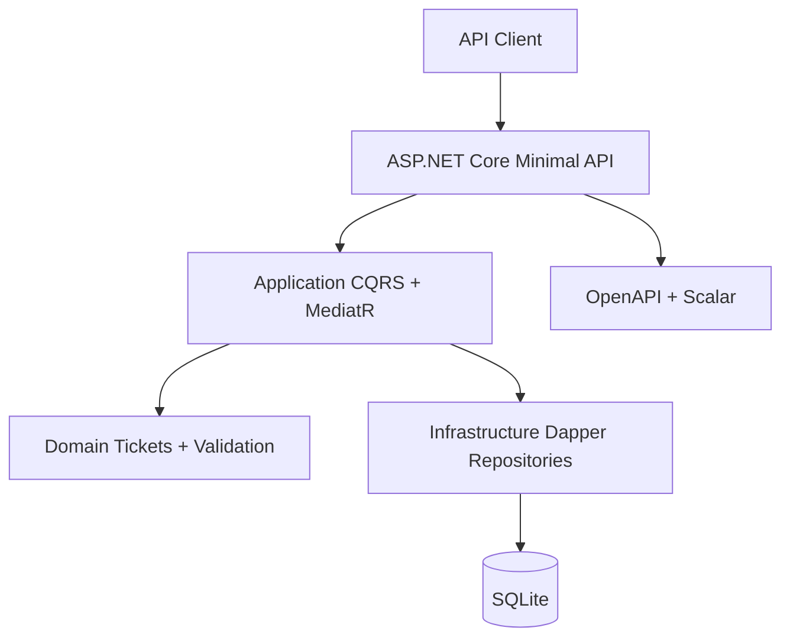

# 🏦 Homework 2: Intelligent Customer Support System

> **Student Name**: Vitalii Kulykivskyi
> **Date Submitted**: 2026-05-17
> **AI Tools Used**: [List tools, e.g., Claude Code, GitHub Copilot]
Homework 2 implementation of a customer support ticket management API using **.NET 10**, Clean Architecture, SQLite, Dapper, MediatR, FluentValidation, OpenAPI, Scalar, xUnit, coverlet, and NBomber.

## Features

- REST API for ticket create, list, get, update, delete, and bulk import.
- CSV, JSON, and XML ticket import with per-record validation summaries.
- Keyword-based auto-classification for category, priority, confidence, reasoning, and matched keywords.
- Optional create-time classification via `POST /tickets?auto_classify=true`.
- SQLite persistence with schema bootstrap, classification metadata storage, indexes, WAL mode, and busy timeout.
- Automated unit, integration, API, and performance tests with an enforced 85% total line coverage gate.

## Architecture



The solution follows Clean Architecture:

- `src/Domain`: ticket entity, enums, metadata, classification value object, and validation rules.
- `src/Application`: CQRS commands/queries, handlers, validators, import parsers, classifier service, and repository contract.
- `src/Infrastructure`: SQLite connection factory and Dapper repository.
- `src/API`: Minimal API endpoints, HTTP contracts, OpenAPI, and Scalar.
- `tests/Tests`: xUnit tests, integration tests, import parser tests, coverage configuration, and NBomber performance gates.

## Setup

Prerequisites:

- .NET 10 SDK
- Optional: ReportGenerator for HTML coverage reports

Restore and build:

```bash
dotnet restore CustomerSupportSystem.slnx
dotnet build CustomerSupportSystem.slnx
```

Run the API:

```bash
dotnet run --project src/API/API.csproj
```

Development URLs:

- API health check: `http://localhost:5077/health`
- Scalar API reference: `http://localhost:5077/scalar/v1`
- OpenAPI JSON: `http://localhost:5077/openapi/v1.json`

## Testing And Coverage

Run the full coverage-gated suite:

```bash
dotnet test
```

Current verification:

- 89 tests passed.
- Total line coverage: 93.24%.
- Coverage screenshot: `docs/screenshots/test_coverage.png`.
- HTML report: `tests/Tests/coverage-report/index.html`.

Generate the HTML report after running tests:

```bash
reportgenerator -reports:"tests/Tests/coverage.cobertura.xml" -targetdir:"tests/Tests/coverage-report" -reporttypes:Html
```

Performance tests use NBomber and assert quality gates for failure rate, average request execution time, max request execution time, and P95 latency.

## Sample Data

Sample deliverables are under `tests/fixtures/`:

- `sample_tickets.csv`: 50 tickets.
- `sample_tickets.json`: 20 tickets.
- `sample_tickets.xml`: 30 tickets.
- `invalid_tickets.csv`, `invalid_tickets.json`, `invalid_tickets.xml`: negative import samples.

## Documentation

- API reference: `docs/API_REFERENCE.md`
- Architecture notes: `docs/ARCHITECTURE.md`
- Testing guide: `docs/TESTING_GUIDE.md`
- Implementation checklist: `docs/IMPLEMENTATION_PLAN.md`
- Run guide: `HOWTORUN.md`
