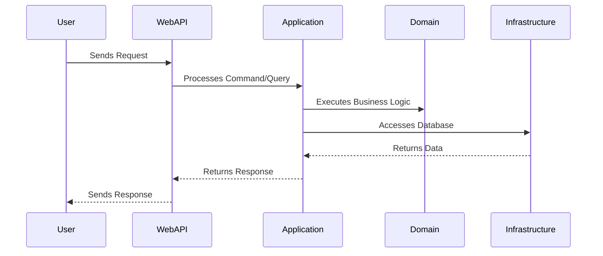

# Architecture

This document outlines the architecture of the Intelligent Customer Support System.

## High-Level Architecture

The project follows **Clean Architecture** principles, adhering to **SOLID** principles and leveraging **Domain-Driven Design (DDD)**. The architecture is structured into the following layers:

- **Domain Layer**: Contains core business logic, entities, and value objects.
- **Application Layer**: Implements the CQRS pattern using MediatR for command and query handling.
- **Infrastructure Layer**: Handles data access using Dapper and SQLite as the database.
- **Presentation Layer**: Provides a RESTful WebAPI and Scalar UI for user interaction.

### High-Level Architecture Diagram
```mermaid
graph TD
    A[Presentation Layer (WebAPI, Scalar UI)] --> B[Application Layer (CQRS, MediatR)]
    B --> C[Domain Layer (Entities, Business Logic)]
    B --> D[Infrastructure Layer (Dapper, SQLite)]
```

## Component Descriptions

### Domain Layer
- Core of the application.
- Contains entities, value objects, and domain services.
- Independent of external frameworks.

### Application Layer
- Implements the **CQRS** pattern using **MediatR**.
- Handles commands and queries.
- Coordinates between the Domain and Infrastructure layers.

### Infrastructure Layer
- Responsible for data access.
- Uses **Dapper** as the ORM for lightweight and efficient database operations.
- Stores data in **SQLite** for simplicity and portability.

### Presentation Layer
- Exposes a **RESTful WebAPI** for external integrations.
- Provides a **Scalar UI** for user interaction.

## Data Flow Diagrams

### Request Flow


## Design Decisions and Trade-Offs

### Clean Architecture
- Ensures separation of concerns.
- Promotes testability and maintainability.

### Domain-Driven Design (DDD)
- Focuses on the core business domain.
- Aligns the code structure with business concepts.

### CQRS with MediatR
- Simplifies the separation of read and write operations.
- Improves scalability and maintainability.

### Dapper and SQLite
- **Dapper**: Lightweight ORM for high performance.
- **SQLite**: Simple and portable database solution.

## Security and Performance Considerations
*(To be added)*