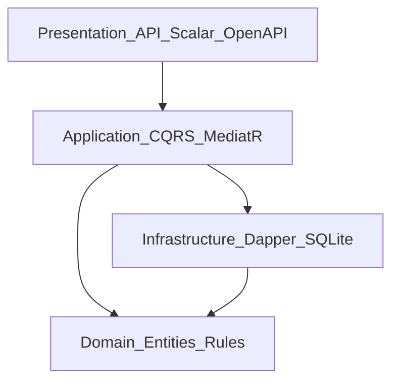
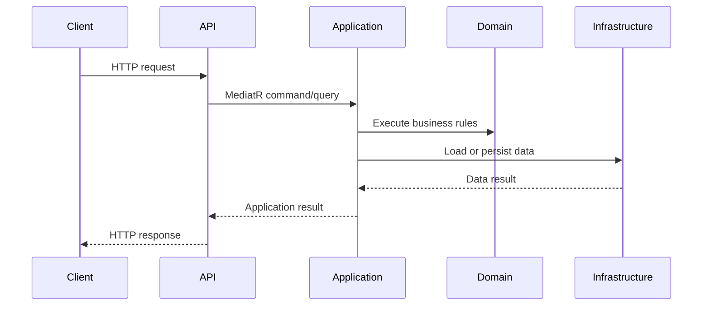
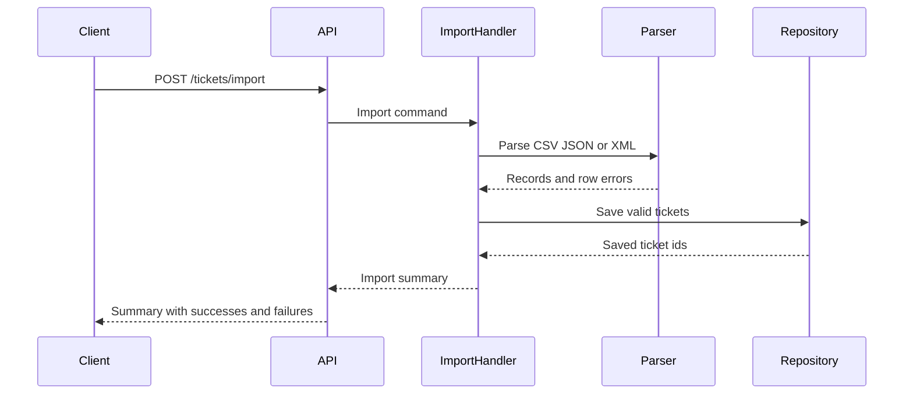

# Architecture

This document outlines the target architecture for the Intelligent Customer Support System and records the current implementation state.

## Current Implementation Status

The repository is currently through **Phase 2**:

- The solution contains `Domain`, `Application`, `Infrastructure`, `API`, and `Tests`.
- The API starts successfully and exposes `/health`, OpenAPI JSON, and Scalar UI.
- Dependency injection extension points exist in `Application` and `Infrastructure`, including SQLite repository registration.
- Ticket domain entities, enums, metadata, and validation result types are implemented under `src/Domain/Tickets`.
- `ITicketRepository` is defined in Application and implemented by a Dapper-backed SQLite repository in Infrastructure.
- CQRS handlers, import, and classification are still planned.

## High-Level Architecture

The project follows **Clean Architecture** principles, with dependencies flowing inward toward the domain model. The target structure is:

- **Domain Layer**: Entities, value objects, enums, and business rules.
- **Application Layer**: CQRS commands/queries, MediatR handlers, validation orchestration.
- **Infrastructure Layer**: Dapper repositories, SQLite storage, schema setup.
- **Presentation Layer**: ASP.NET Core REST API, OpenAPI JSON, and Scalar API reference.

## Component Descriptions

### Domain Layer

The domain layer is the core of the system. It should remain independent of ASP.NET Core, Dapper, SQLite, MediatR, and other infrastructure packages.

Current contents:

- `DomainAssemblyMarker` for test and dependency wiring verification.
- `Ticket` entity.
- `TicketDraft` input model for domain creation.
- `TicketMetadata`.
- Ticket category, priority, status, source, and device-type enums.
- Domain validation rules that do not depend on web or database concerns.

Planned contents:

- Classification-related value objects if needed.

### Application Layer

The application layer coordinates use cases and owns request/response shapes for commands and queries.

Current contents:

- `AddApplication()` service registration.
- MediatR assembly scanning.
- FluentValidation assembly scanning.
- `ITicketRepository` contract for ticket persistence.

Planned contents:

- CQRS handlers for ticket create, update, delete, get, list, import, and auto-classify.
- Validation behavior and structured application results.

### Infrastructure Layer

The infrastructure layer implements external concerns.

Current contents:

- `AddInfrastructure()` service registration.
- Dapper and SQLite packages are installed.
- `SqliteConnectionFactory` for connection management.
- `SqliteTicketRepository` with schema bootstrap, parameterized SQL, and JSON storage for tags and metadata.

Planned contents:

- Optional SQLite concurrency settings such as WAL mode.

### Presentation Layer

The API layer exposes HTTP endpoints and maps application results to status codes.

Current Phase 0 contents:

- `/health`
- `/openapi/v1.json`
- `/scalar/v1`

Planned contents:

- Ticket CRUD endpoints.
- Multi-format import endpoint.
- Auto-classification endpoint.
- Consistent `ProblemDetails` or equivalent JSON error responses.

## Request Flow

## Import Flow

## Design Decisions and Trade-Offs

### Clean Architecture

The layer split keeps API and database details out of the domain model. This makes domain validation and classification easier to test with fast unit tests.

### CQRS with MediatR

Commands and queries keep use cases explicit and provide a natural place for validation, logging, and result mapping. The trade-off is extra ceremony, which is acceptable because the homework requires multiple workflows and test types.

### Dapper and SQLite

Dapper keeps persistence lightweight and explicit. SQLite is simple for local development and demo usage. The repository stores tags and metadata as JSON text and uses parameterized SQL for all writes and lookups. For concurrent write-heavy scenarios, the implementation should consider WAL mode, short transactions, and retry behavior, then document final limits after integration tests are implemented.

### OpenAPI and Scalar

OpenAPI JSON and Scalar UI are exposed by default in Phase 0. This keeps the API discoverable as endpoints are added.

## Security Considerations

- Validate all external input before creating or updating tickets.
- Use parameterized SQL through Dapper to avoid SQL injection.
- Return structured validation errors without leaking stack traces or internal SQL details.
- Treat uploaded CSV, JSON, and XML as untrusted input.
- Avoid logging sensitive customer data such as full descriptions if logs are retained.

## Performance Considerations

- Keep parsers streaming or bounded when importing larger files.
- Use repository methods that support filtered queries at the database level instead of filtering all tickets in memory.
- Add indexes for common filters such as `category`, `priority`, `status`, and `created_at` once the schema exists.
- Measure bulk import and classification behavior in the performance tests required by [TASKS.md](../TASKS.md).