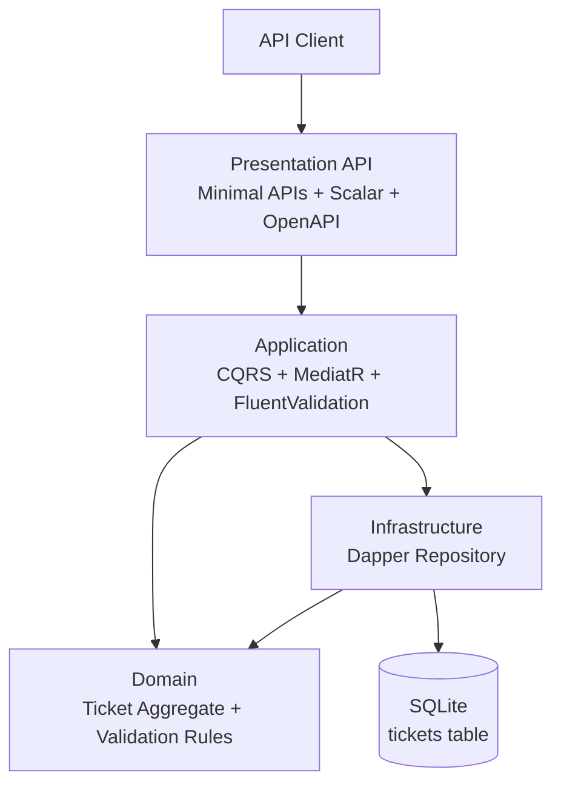
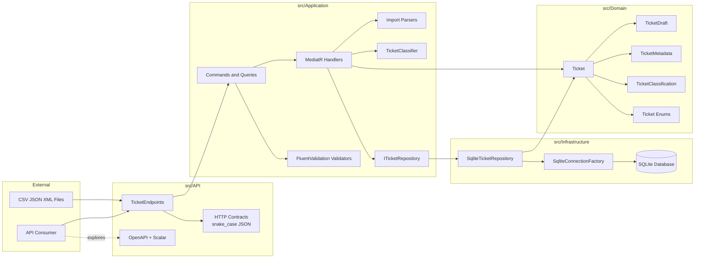
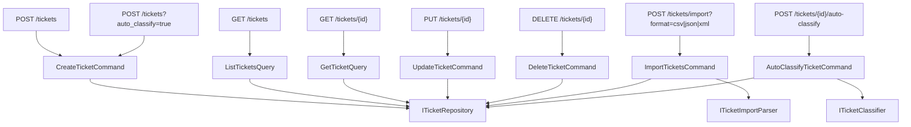
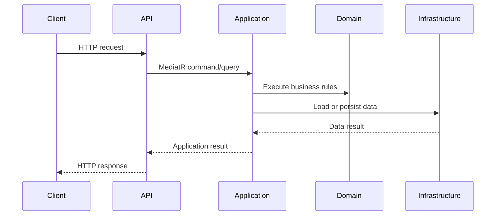
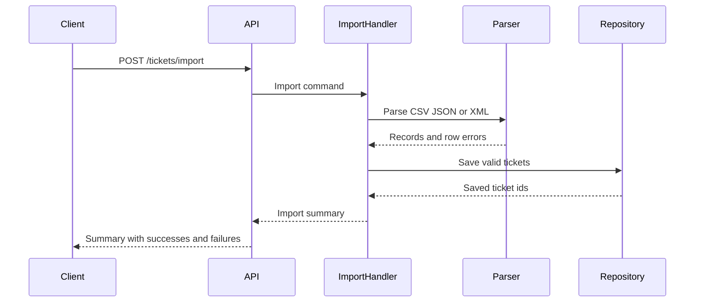
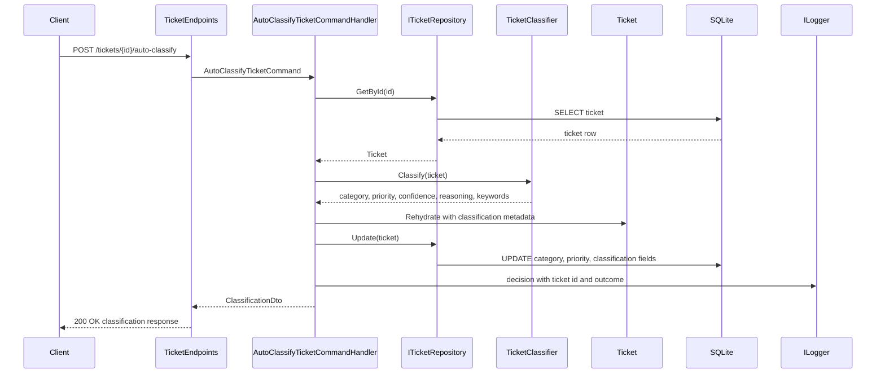
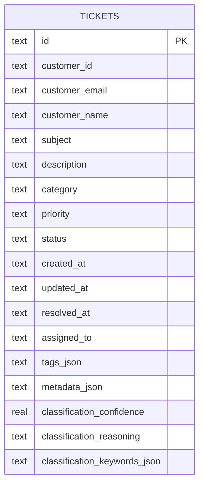
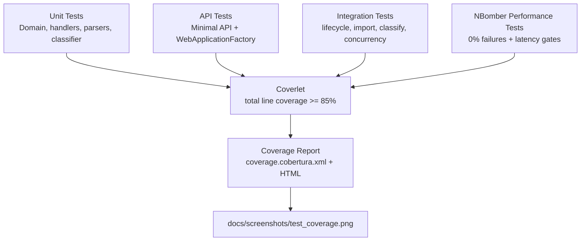

# Architecture

This document outlines the target architecture for the Intelligent Customer Support System and records the current implementation state.

## Current Implementation Status

The repository is currently through **Phase 8**:

- The solution contains `Domain`, `Application`, `Infrastructure`, `API`, and `Tests`.
- The API starts successfully and exposes `/health`, OpenAPI JSON, and Scalar UI.
- Dependency injection extension points exist in `Application` and `Infrastructure`, including SQLite repository registration.
- Ticket domain entities, enums, metadata, and validation result types are implemented under `src/Domain/Tickets`.
- `ITicketRepository` is defined in Application and implemented by a Dapper-backed SQLite repository in Infrastructure.
- CQRS handlers, FluentValidation validators, application result types, and ticket DTOs are implemented for create, get, list, update, and delete.
- REST ticket CRUD endpoints are implemented with Minimal APIs, DataAnnotations request validation, snake_case JSON, and MediatR delegation.
- CSV, JSON, and XML import parsers are implemented in Application with per-record errors and a raw-body `POST /tickets/import` endpoint.
- Auto-classification is implemented with keyword rules, classification metadata persistence, decision logging, and a `POST /tickets/{id}/auto-classify` endpoint.
- Integration and performance tests cover full HTTP workflows, concurrent operations, import throughput, classification throughput, and filtered list performance.
- Final deliverables include sample CSV/JSON/XML data, a coverage screenshot, and README/documentation updates.

## High-Level Architecture

The project follows **Clean Architecture** principles, with dependencies flowing inward toward the domain model. The target structure is:

- **Domain Layer**: Entities, value objects, enums, and business rules.
- **Application Layer**: CQRS commands/queries, MediatR handlers, validation orchestration.
- **Infrastructure Layer**: Dapper repositories, SQLite storage, schema setup.
- **Presentation Layer**: ASP.NET Core REST API, OpenAPI JSON, and Scalar API reference.

## Container View

## Component Descriptions

### Domain Layer

The domain layer is the core of the system. It should remain independent of ASP.NET Core, Dapper, SQLite, MediatR, and other infrastructure packages.

Current contents:

- `DomainAssemblyMarker` for test and dependency wiring verification.
- `Ticket` entity.
- `TicketDraft` input model for domain creation.
- `TicketMetadata`.
- `TicketClassification`.
- Ticket category, priority, status, source, and device-type enums.
- Domain validation rules that do not depend on web or database concerns.

### Application Layer

The application layer coordinates use cases and owns request/response shapes for commands and queries.

Current contents:

- `AddApplication()` service registration.
- MediatR assembly scanning.
- FluentValidation assembly scanning.
- `ITicketRepository` contract for ticket persistence.
- Application result and error contracts for API-ready success, validation, and not-found outcomes.
- Ticket commands and queries for create, get, list, update, and delete.
- FluentValidation validators and MediatR handlers for ticket commands and queries.
- `IClock` abstraction for deterministic timestamp handling in tests.
- Import parsers for CSV, JSON, and XML plus an import command handler that returns total, successful, and failed record summaries.
- Ticket classifier service plus CQRS handlers for explicit and create-time auto-classification.

### Infrastructure Layer

The infrastructure layer implements external concerns.

Current contents:

- `AddInfrastructure()` service registration.
- Dapper and SQLite packages are installed.
- `SqliteConnectionFactory` for connection management, WAL mode, normal synchronous writes, and a 5-second SQLite busy timeout.
- `SqliteTicketRepository` with schema bootstrap, lightweight schema migration for classification columns, parameterized SQL, and JSON storage for tags, metadata, and classification keywords.
- Filtered ticket listing by `category`, `priority`, and `status`.

### Presentation Layer

The API layer exposes HTTP endpoints and maps application results to status codes.

Current contents:

- `/health`
- `/openapi/v1.json`
- `/scalar/v1`
- `POST /tickets`
- `GET /tickets`
- `GET /tickets/{id}`
- `PUT /tickets/{id}`
- `DELETE /tickets/{id}`
- `POST /tickets/import`
- `POST /tickets/{id}/auto-classify`
- DataAnnotations request models for HTTP input validation.
- Consistent `ProblemDetails` or equivalent JSON error responses.

## Endpoint To Use Case Map

## Request Flow

## Import Flow

## Auto-Classification Flow

## Persistence Model

SQLite stores simple scalar fields directly and stores `tags`, metadata, and classification keywords as JSON text. The repository rehydrates rows into the domain model and validates stored enum/timestamp values before returning tickets to the application layer.

## Test And Quality Gates

## Design Decisions and Trade-Offs

### Clean Architecture

The layer split keeps API and database details out of the domain model. This makes domain validation and classification easier to test with fast unit tests.

### CQRS with MediatR

Commands and queries keep use cases explicit and provide a natural place for validation, logging, and result mapping. The trade-off is extra ceremony, which is acceptable because the homework requires multiple workflows and test types.

### Dapper and SQLite

Dapper keeps persistence lightweight and explicit. SQLite is simple for local development and demo usage. The repository stores tags, metadata, and classification keywords as JSON text and uses parameterized SQL for all writes and lookups.

SQLite connections enable WAL mode, `synchronous=NORMAL`, and a 5-second `busy_timeout`. Phase 7 integration tests exercise at least 20 parallel creates followed by 20 parallel updates and assert no lost tickets. This is sufficient for local/demo concurrency, but SQLite still allows only one writer at a time; sustained production write-heavy workloads should move to a server database or add a queue/retry policy around write paths.

### OpenAPI and Scalar

OpenAPI JSON and Scalar UI are exposed by default. This keeps the API discoverable as endpoints are added.

### API Validation

The API layer validates request DTOs with DataAnnotations before sending commands to MediatR. Application handlers still run FluentValidation and domain validation, so HTTP validation catches malformed request payloads while application validation protects non-HTTP callers.

## Security Considerations

- Validate all external input before creating or updating tickets.
- Use parameterized SQL through Dapper to avoid SQL injection.
- Return structured validation errors without leaking stack traces or internal SQL details.
- Treat uploaded CSV, JSON, and XML as untrusted input.
- Avoid logging sensitive customer data such as full descriptions if logs are retained.

## Performance Considerations

- Keep parsers streaming or bounded when importing larger files.
- Use repository methods that support filtered queries at the database level instead of filtering all tickets in memory.
- Use indexes for common filters such as `category`, `priority`, and `status`.
- Keep auto-classification keyword-based and in-process; it is deterministic and fast enough for create-time classification in the current homework scope.
- Phase 7 performance tests measure bulk import, auto-classification, and filtered list behavior under documented local thresholds.