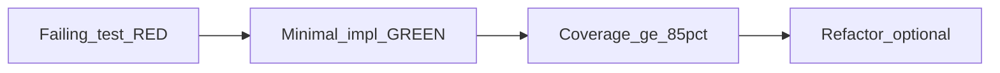
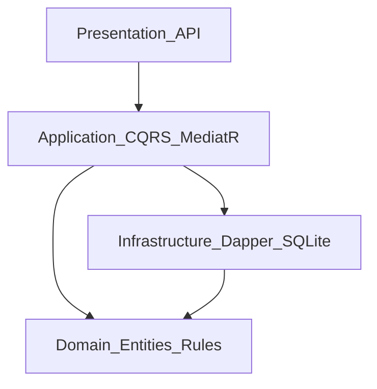

# Implementation Plan — Intelligent Customer Support System (Homework 2)

This checklist is the working plan for implementing [TASKS.md](../TASKS.md) in the [.NET solution](../CustomerSupportSystem.slnx) using **Clean Architecture** as described in [ARCHITECTURE.md](ARCHITECTURE.md). Mark items `[x]` when done.

---

## How to use this document

For **every step** below, repeat the cycle:

1. **RED** — Write or extend an automated test that fails and specifies the next behavior.
2. **GREEN** — Implement the smallest production change that makes the test pass.
3. **REFACTOR** (optional) — Improve design without changing behavior; keep tests green.
4. **Coverage gate** — Run tests with coverage (see [Coverage commands](#coverage-commands-and-thresholds)). **Do not mark the step complete** until **total line coverage ≥ 85%** for all instrumented production projects (see [Coverage scope](#coverage-scope-per-phase)).



---

## Conventions

### Stack (aligned with [ARCHITECTURE.md](ARCHITECTURE.md))

| Layer | Responsibility | Key packages |
|-------|----------------|--------------|
| **Domain** | Entities, value objects, enums, domain rules | No ORM, no MediatR |
| **Application** | CQRS: commands/queries, MediatR handlers, validation orchestration | MediatR, FluentValidation (recommended) |
| **Infrastructure** | SQLite + Dapper, repository implementations, migrations/schema bootstrap | Dapper, Microsoft.Data.Sqlite |
| **API (Presentation)** | REST endpoints, OpenAPI, Scalar | ASP.NET Core OpenAPI, Scalar.AspNetCore (or equivalent) |

### Test project layout (maps [TASKS.md](../TASKS.md) names to C# / xUnit)

| TASKS name | Test file (suggested) |
|------------|------------------------|
| `test_ticket_api` | `tests/Tests/TicketApiTests.cs` — **11 tests** |
| `test_ticket_model` | `tests/Tests/TicketModelTests.cs` — **9 tests** |
| `test_import_csv` | `tests/Tests/ImportCsvTests.cs` — **6 tests** |
| `test_import_json` | `tests/Tests/ImportJsonTests.cs` — **5 tests** |
| `test_import_xml` | `tests/Tests/ImportXmlTests.cs` — **5 tests** |
| `test_categorization` | `tests/Tests/CategorizationTests.cs` — **10 tests** |
| `test_integration` | `tests/Tests/IntegrationTests.cs` — **5 tests** |
| `test_performance` | `tests/Tests/PerformanceTests.cs` — **5 tests** |
| `fixtures/` | `tests/fixtures/` — valid + invalid sample files |

### HTTP semantics (quick reference for API tests and [API_REFERENCE.md](API_REFERENCE.md))

| Situation | Status |
|-----------|--------|
| Create ticket success | `201 Created` |
| Validation / malformed body / unusable import file | `400 Bad Request` |
| Missing ticket | `404 Not Found` |
| List / get / update / delete success (non-create) | `200 OK` (or `204 No Content` for delete if you choose—document in API_REFERENCE) |
| Bulk import with partial failures | Choose `200` with summary body vs `207 Multi-Status`—**document one approach** and stay consistent |

### Coverage scope per phase

- **“Coverage on each step”** means: after finishing the **checkbox group** for that step (RED → GREEN → optional REFACTOR), the **cumulative** line coverage across all referenced production assemblies is **≥ 85%**. You do not need to hit 85% on every micro-commit inside a group, but you **must** before checking the group done.
- **Phase 0–1**: Instrument **Domain** (and shared abstractions only if needed).
- **Phase 2**: Add **Infrastructure** to instrumentation; keep **Domain + Infrastructure** ≥ 85%.
- **Phase 3+**: Add **Application**; then **API** as endpoints and `Program.cs` grow.

### Coverage commands and thresholds

- [TESTING_GUIDE.md](TESTING_GUIDE.md) documents `dotnet test` and collector output under `TestResults/`.
- **Enforce failure below 85%:** add [`coverlet.msbuild`](https://github.com/coverlet-coverage/coverlet) to the test project (alongside existing `coverlet.collector` in [tests/Tests/Tests.csproj](../tests/Tests/Tests.csproj)) and set MSBuild properties, for example:
  - `Threshold=85`
  - `ThresholdType=line`
  - `ThresholdStat=total`
- **Include production code:** add `ProjectReference` from `tests/Tests` to `src/Domain`, `src/Application`, `src/Infrastructure`, and `src/API` when those projects contain code under test.
- **Remove dead template code** ([src/API/Program.cs](../src/API/Program.cs) weather sample) early so uncovered lines do not block the gate.

Example (run from repo root `homework-2`):

```bash
dotnet test --collect:"XPlat Code Coverage"
```

Use **ReportGenerator** or Visual Studio coverage results to inspect line coverage during development; capture the final screenshot for [docs/screenshots/test_coverage.png](screenshots/test_coverage.png).

---

## Documentation kept in sync (do not defer to the end only)

While implementing phases, fill placeholders in:

- [API_REFERENCE.md](API_REFERENCE.md) — every endpoint, models, errors, cURL examples.
- [ARCHITECTURE.md](ARCHITECTURE.md) — security, performance, and any trade-offs you choose (e.g., SQLite concurrency, WAL).
- [TESTING_GUIDE.md](TESTING_GUIDE.md) — performance benchmarks table with measured numbers.

---

## Phase 0 — Solution baseline and tooling

- [x] **RED**: Add a failing test that asserts the test project can reference **Domain** (e.g., a trivial assertion on a type or constant you will add next) — or a failing `WebApplicationFactory` smoke test once API is wired.
- [x] **GREEN**:
  - [x] Restore a valid solution: ensure [CustomerSupportSystem.slnx](../CustomerSupportSystem.slnx) (or add a `.sln`) lists **Domain**, **Application**, **Infrastructure**, **API**, **Tests**.
  - [x] Project references: **Application → Domain**; **Infrastructure → Application + Domain** (adjust if you place interfaces in Domain only); **API → Application + Infrastructure** (per your boundaries).
  - [x] Packages: **MediatR**, **FluentValidation** + **FluentValidation.DependencyInjectionExtensions**, **Dapper**, **Microsoft.Data.Sqlite**, **Scalar** (OpenAPI UI), testing: **Microsoft.AspNetCore.Mvc.Testing**, **FluentAssertions** (optional but useful).
  - [x] Register DI: MediatR assembly scan, validators, SQLite connection, repository, `IDbConnection` factory or scoped connection policy.
- [x] **RED → GREEN**: Remove **WeatherForecast** / template minimal API from [Program.cs](../src/API/Program.cs); replace with OpenAPI + Scalar + empty or health endpoint covered by tests.
- [x] **Coverage**: `dotnet test` with threshold **≥ 85%** on instrumented projects (small codebase — no dead endpoints).

---

## Phase 1 — Domain model and validation (`test_ticket_model`, **9 tests**)

**Layer:** [src/Domain](../src/Domain) only (no persistence attributes).

- [x] **RED** — Failing tests in `TicketModelTests.cs` for [TASKS.md](../TASKS.md) ticket shape:
  - [x] Required fields: `customer_id`, `customer_email`, `customer_name`, `subject`, `description`, category, priority, status, tags, metadata.
  - [x] **Email** format validation.
  - [x] **Subject** length **1–200**; **description** **10–2000**.
  - [x] **Enums**: `category` (`account_access | technical_issue | billing_question | feature_request | bug_report | other`), `priority`, `status`.
  - [x] **Metadata**: `source`, optional `browser`, `device_type` enum.
  - [x] **Timestamps**: `created_at`, `updated_at`; `resolved_at` nullable.
  - [x] **Id**: UUID string on create (test factory or builder).
- [x] **GREEN**: Implement entity (e.g., `Ticket`), value objects if used, enums, and factory/validation helpers consumed later by FluentValidation.
- [x] **REFACTOR**: Keep domain pure; validation rules readable and test-named.
- [x] **Coverage**: **Line coverage ≥ 85%** for **Domain** assembly.

---

## Phase 2 — Persistence (`test_ticket_model` / repository tests or dedicated `TicketRepositoryTests`)

**Layer:** [src/Infrastructure](../src/Infrastructure)

- [x] **RED**: Tests against **SQLite** (in-memory or temp file) for:
  - [x] Schema creation / bootstrap (table matches ticket fields + JSON columns for `tags`/`metadata` if stored as text).
  - [x] **Insert** → read round-trip (all fields).
  - [x] **Update** updates `updated_at`; optional `resolved_at`.
  - [x] **Delete** removes row.
  - [x] **Get by id** returns null for unknown id.
- [x] **GREEN**: Dapper repository implementing interfaces (define `ITicketRepository` in **Application** or **Domain** per ARCHITECTURE); connection management; parameterized SQL.
- [x] **Coverage**: **≥ 85%** cumulative **Domain + Infrastructure**.

---

## Phase 3 — Application layer: CQRS handlers

**Layer:** [src/Application](../src/Application)

- [x] **RED**: Handler tests (in-memory fake repository **or** SQLite repository from Phase 2):
  - [x] **CreateTicket** — valid create; invalid → structured errors.
  - [x] **GetTicket** — found / not found.
  - [x] **ListTickets** — no filter; **combined filter** by `category` **and** `priority` ([TASKS.md](../TASKS.md) Task 5).
  - [x] **UpdateTicket** — partial update rules; manual override of category/priority after auto-classify (prepare for Phase 6).
  - [x] **DeleteTicket** — success / not found.
- [x] **GREEN**: MediatR `IRequest`/`IRequestHandler`, FluentValidation validators, mapping domain errors to application result types used by API.
- [x] **Coverage**: **≥ 85%** cumulative **Domain + Application + Infrastructure**.

---

## Phase 4 — REST API — Task 1 endpoints (`test_ticket_api`, **11 tests**)

**Layer:** [src/API](../src/API) — map behaviors into [API_REFERENCE.md](API_REFERENCE.md).

- [x] **RED** — `TicketApiTests.cs` with `WebApplicationFactory`:
  - [x] `POST /tickets` — `201`, body contains `id`, timestamps; invalid body → `400`.
  - [x] `GET /tickets` — returns list; query filters (at least category, priority, status as required by product).
  - [x] `GET /tickets/{id}` — `200` / `404`.
  - [x] `PUT /tickets/{id}` — `200` / `400` / `404`.
  - [x] `DELETE /tickets/{id}` — success + `404`.
  - [x] **Content negotiation / error shape** consistent (ProblemDetails or your JSON error contract — document in API_REFERENCE).
- [x] **GREEN**: Minimal APIs or controllers; **only** delegate to MediatR; map results to HTTP status codes.
- [x] **Coverage**: **≥ 85%** including **API** (add narrow tests for `Program.cs` registration if needed).

---

## Phase 5 — Multi-format import (`test_import_csv` **6**, `test_import_json` **5**, `test_import_xml` **5**) + `POST /tickets/import`

**Layers:** Application (handler + parsers), API

- [x] **RED** — Fixtures in `tests/fixtures/`:
  - [x] **CSV**: valid multi-row; missing header; bad email row; quoted fields; partial success.
  - [x] **JSON**: array of tickets; wrapper object; invalid schema; empty array.
  - [x] **XML**: valid list; malformed XML; wrong root/elements.
- [x] **GREEN**:
  - [x] Parsers return **DTOs + per-row errors** (no half-insert without summary).
  - [x] **Import handler** returns summary: `total`, `successful`, `failed` with **error details** per failed record ([TASKS.md](../TASKS.md)).
  - [x] `POST /tickets/import` — multipart or raw body (choose one; document in API_REFERENCE); unusable file → `400`; valid file with row failures → **documented** success response with failures list.
- [x] **Coverage**: **≥ 85%**; cover every parser branch and API error path.

---

## Phase 6 — Auto-classification (Task 2) + `POST /tickets/{id}/auto-classify`

**Layers:** Domain/Application (classifier), Infrastructure (persist confidence), API

- [x] **RED** — `CategorizationTests.cs` (**10 tests**):
  - [x] Keyword → **category** rules: login/password/2FA → `account_access`; payment/invoice/refund → `billing_question`; etc. per [TASKS.md](../TASKS.md).
  - [x] Keyword → **priority**: urgent / high / medium (default) / low lists.
  - [x] **Confidence** in `[0, 1]`; **reasoning** string; **keywords_found** collection.
  - [x] Manual **override** on update clears or replaces auto fields per your spec (test the chosen behavior).
  - [x] **Logging**: decision logged (use `ILogger` fake or `TestLogger` — assert log was called with ticket id + outcome).
- [x] **GREEN**: Classifier service; store **classification confidence** on ticket; update repository and handlers.
- [x] **RED**: API tests for `POST /tickets/{id}/auto-classify` response shape; `404` when missing.
- [x] **GREEN**: Optional **`auto_classify`** flag on `POST /tickets` (query or body — pick one, document); auto-run classifier when true.
- [x] **Coverage**: **≥ 85%**.

---

## Phase 7 — Integration and performance (`test_integration` **5**, `test_performance` **5**)

- [ ] **RED** — `IntegrationTests.cs`:
  - [ ] **Full lifecycle**: create → update status → resolve → get → delete (or close).
  - [ ] **Bulk import** then verify **auto-classification** on selected rows (or on tickets created with flag).
  - [ ] **Concurrent operations**: **≥ 20** parallel creates/updates; assert **no lost updates** / consistent counts (define acceptable SQLite behavior under load).
  - [ ] **Combined filtering** by category **and** priority on `GET /tickets`.
  - [ ] **Additional E2E** flow of your choice (e.g., import → classify → list filter).
- [ ] **GREEN**: Fix contention (WAL mode, retries, or serialize where needed); document limits in ARCHITECTURE.
- [ ] **RED** — `PerformanceTests.cs` (**5**): e.g., import **N** tickets under time budget; classify **M** tickets; list with filter; document thresholds in test names/constants.
- [ ] **GREEN**: Tune only if tests fail; fill **Performance benchmarks** table in [TESTING_GUIDE.md](TESTING_GUIDE.md).
- [ ] **Coverage**: **≥ 85%** overall solution.

---

## Phase 8 — Deliverables, coverage screenshot, README

- [ ] **Sample data** (per [TASKS.md](../TASKS.md)):
  - [ ] `sample_tickets.csv` — **50** rows.
  - [ ] `sample_tickets.json` — **20** objects.
  - [ ] `sample_tickets.xml` — **30** tickets.
  - [ ] Invalid sample files for negative tests (names/locations documented in README and TESTING_GUIDE).
- [ ] **Coverage report** + screenshot **[docs/screenshots/test_coverage.png](screenshots/test_coverage.png)** showing **> 85%**.
- [ ] **README.md** — replace Homework 1 boilerplate: Homework 2 overview, features, Mermaid architecture (README requirement), setup, `dotnet test` + coverage, folder structure, link to docs.

---

## Architecture traceability (quick map)



| Phase | Domain | Application | Infrastructure | API |
|-------|--------|-------------|----------------|-----|
| 1 | ✓ | | | |
| 2 | ✓ | contracts | ✓ | |
| 3 | ✓ | ✓ | ✓ | |
| 4 | ✓ | ✓ | ✓ | ✓ |
| 5 | ✓ | ✓ | ✓ | ✓ |
| 6 | ✓ | ✓ | ✓ | ✓ |
| 7–8 | — | — | — | verify E2E + docs |

---

## Checklist summary (counts from [TASKS.md](../TASKS.md))

| Area | Tests required |
|------|------------------|
| Ticket API | 11 |
| Ticket model | 9 |
| CSV import | 6 |
| JSON import | 5 |
| XML import | 5 |
| Categorization | 10 |
| Integration | 5 |
| Performance | 5 |
| **Total** | **56** |

---

_End of implementation plan. Mark sections complete as you implement; keep docs and tests aligned with behavior._
