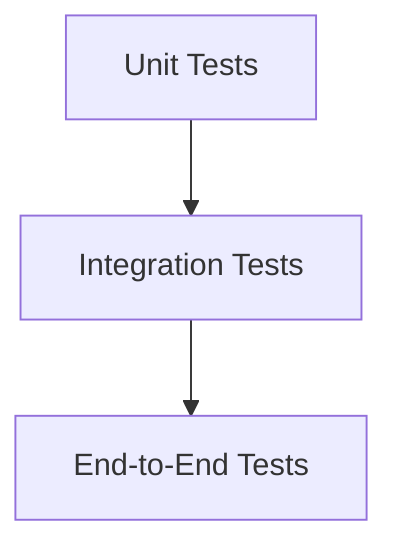

# Testing Guide

This document provides guidance for testing the Intelligent Customer Support System implemented in **.NET 10**.

## Test Pyramid Diagram

The testing strategy follows the test pyramid approach, ensuring a balanced distribution of tests:



- **Unit Tests**: Foundation of the pyramid, covering individual components.
- **Integration Tests**: Validate interactions between components.
- **End-to-End Tests**: Ensure the entire system works as expected.

## How to Run Tests

To run the automated test suite, use the following commands:

1. **Run all tests**:
   ```bash
   dotnet test
   ```

2. **Generate a test coverage report**:
   ```bash
   dotnet test --collect:"Code Coverage"
   ```

The coverage report will be generated in the `TestResults/` directory. Ensure the overall coverage is ≥85%.

## Sample Test Data Locations

Sample data files for testing are located in the `tests/fixtures/` directory:

- `sample_tickets.csv`: 50 sample tickets in CSV format.
- `sample_tickets.json`: 20 sample tickets in JSON format.
- `sample_tickets.xml`: 30 sample tickets in XML format.
- Invalid data files for negative test cases.

## Manual Testing Checklist

Use the following checklist for manual testing:

- [ ] Verify all API endpoints respond with correct status codes.
- [ ] Validate error handling for malformed requests.
- [ ] Test the Scalar UI for usability and responsiveness.
- [ ] Confirm auto-classification logic works as expected.
- [ ] Measure performance benchmarks for bulk imports.

## Performance Benchmarks Table
*(To be added)*