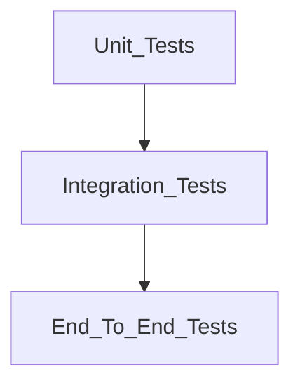

# Testing Guide

This document provides guidance for testing the Intelligent Customer Support System implemented in **.NET 10**.

## Current Implementation Status

The project is currently through **Phase 7**:

- The automated suite contains smoke tests in `tests/Tests/Phase0SmokeTests.cs`.
- The tests verify layer references and the `/health` endpoint.
- `tests/Tests/TicketModelTests.cs` covers the domain ticket model and validation rules.
- `tests/Tests/TicketRepositoryTests.cs` covers SQLite schema bootstrap and repository CRUD behavior.
- `tests/Tests/TicketHandlerTests.cs` covers application commands and queries for create, get, list, update, and delete.
- `tests/Tests/TicketApiTests.cs` covers REST ticket CRUD endpoints, filtering, DataAnnotations validation, and not-found responses.
- `tests/Tests/ImportCsvTests.cs`, `ImportJsonTests.cs`, and `ImportXmlTests.cs` cover parser branches and import summaries.
- `tests/Tests/CategorizationTests.cs` covers keyword classification, confidence metadata, logging, and manual override behavior.
- `tests/Tests/IntegrationTests.cs` covers full HTTP workflows, imports, classification, filtering, and 20 parallel creates/updates.
- `tests/Tests/PerformanceTests.cs` covers benchmark-style budgets for CSV/JSON/XML import, auto-classification, and filtered list queries.
- `tests/fixtures/` contains valid and invalid CSV, JSON, and XML import samples.
- Coverage enforcement is configured in `tests/Tests/Tests.csproj` with an **85% total line coverage** threshold.

## Test Pyramid Diagram

The testing strategy follows the test pyramid approach:



- **Unit tests** cover domain validation, parsers, classification rules, and application handlers.
- **Integration tests** validate API, MediatR, repository, and SQLite interactions.
- **End-to-end tests** verify complete user workflows through HTTP.

## How to Run Tests

Run from the repository root:

```bash
dotnet test CustomerSupportSystem.slnx
```

Run with the enforced coverage gate:

```bash
dotnet test CustomerSupportSystem.slnx /p:CollectCoverage=true /p:CoverletOutputFormat=cobertura /p:Threshold=85 /p:ThresholdType=line /p:ThresholdStat=total
```

Current coverage behavior:

- `coverlet.msbuild` fails the test command if total line coverage drops below **85%**.
- Generated source files under `obj/**/*.cs` are excluded from coverage.
- The Cobertura report is generated under the test project when coverage is collected.
- Latest Phase 7 verification: **89 tests passed**, total line coverage **93.24%**, API line coverage **94.44%**, Application line coverage **93.79%**, Domain line coverage **87.45%**, Infrastructure line coverage **95.00%**.

## Generate HTML Code Coverage Report

The test project generates coverage in Cobertura XML format. Use **ReportGenerator** to convert it to an HTML report.

Install ReportGenerator once:

```bash
dotnet tool install -g dotnet-reportgenerator-globaltool
```

Run tests with coverage:

```bash
dotnet test CustomerSupportSystem.slnx /p:CollectCoverage=true /p:CoverletOutputFormat=cobertura /p:Threshold=85 /p:ThresholdType=line /p:ThresholdStat=total
```

Generate the HTML report:

```bash
reportgenerator -reports:"tests/Tests/coverage.cobertura.xml" -targetdir:"tests/Tests/coverage-report" -reporttypes:Html
```

Open the report:

- Windows: `start tests/Tests/coverage-report/index.html`
- macOS: `open tests/Tests/coverage-report/index.html`
- Linux: `xdg-open tests/Tests/coverage-report/index.html`

## Manual Smoke Testing

Start the API:

```bash
dotnet run --project src/API/API.csproj
```

Or use a demo script:

- Windows: `demo/run.bat`
- Linux: `demo/run-linux.sh`
- macOS: `demo/run-mac.sh`

Verify the health endpoint:

```bash
curl http://localhost:5077/health
```

Expected response:

```json
{
  "status": "ok",
  "service": "CustomerSupportSystem"
}
```

Open API documentation:

- Scalar API reference: `http://localhost:5077/scalar/v1`
- OpenAPI document: `http://localhost:5077/openapi/v1.json`

## Planned Test Files and Counts

The final test suite must satisfy [TASKS.md](../TASKS.md):

- `TicketApiTests.cs`: 11 API endpoint tests.
- `TicketModelTests.cs`: 9 domain/model validation areas (**implemented in Phase 1**).
- `ImportCsvTests.cs`: 6 CSV parsing/import tests.
- `ImportJsonTests.cs`: 5 JSON parsing/import tests.
- `ImportXmlTests.cs`: 5 XML parsing/import tests.
- `CategorizationTests.cs`: 10 classification tests (**implemented in Phase 6**).
- `IntegrationTests.cs`: 5 end-to-end workflow tests (**implemented in Phase 7**).
- `PerformanceTests.cs`: 5 benchmark-style tests (**implemented in Phase 7**).

Total planned tests: **56**.

## Sample Test Data Locations

Planned sample data files should live under `tests/fixtures/`:

- `sample_tickets.csv`: 50 sample tickets in CSV format.
- `sample_tickets.json`: 20 sample tickets in JSON format.
- `sample_tickets.xml`: 30 sample tickets in XML format.
- Invalid CSV, JSON, and XML files for negative test cases.

## Manual Testing Checklist

- [ ] Verify `/health` returns `200 OK`.
- [ ] Verify Scalar UI loads.
- [ ] Verify OpenAPI JSON loads.
- [ ] Verify ticket endpoints respond with documented status codes after Phase 4.
- [ ] Validate error handling for malformed requests after endpoint implementation.
- [x] Confirm auto-classification logic works after Phase 6.
- [x] Measure performance benchmarks for bulk imports after Phase 7.

## Performance Benchmarks

Measured locally on Windows from `PerformanceTests.cs`:

- Bulk CSV import: 50 tickets in 79 ms, budget 3 seconds.
- Bulk JSON import: 20 tickets in 1 second, budget 2 seconds.
- Bulk XML import: 30 tickets in 82 ms, budget 3 seconds.
- Auto-classification batch behavior: 25 tickets in 338 ms, budget 3 seconds.
- Filtered list queries: 100 stored tickets filtered in 166 ms, budget 2 seconds.

These are benchmark-style regression checks, not production load tests. The detailed performance-only run can fail the coverage gate because it intentionally executes only five tests; use the full `dotnet test` command for coverage verification.