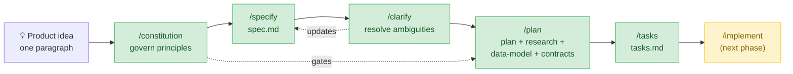
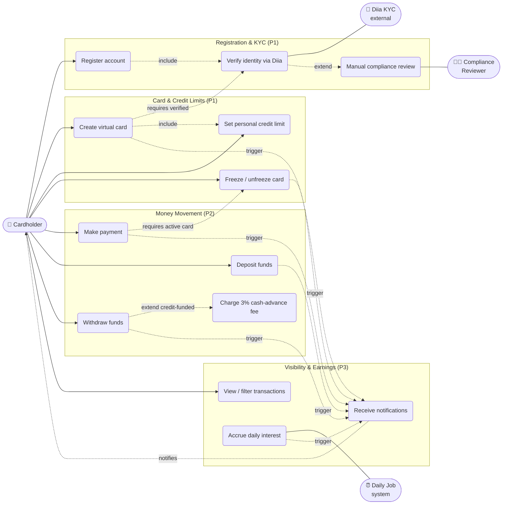
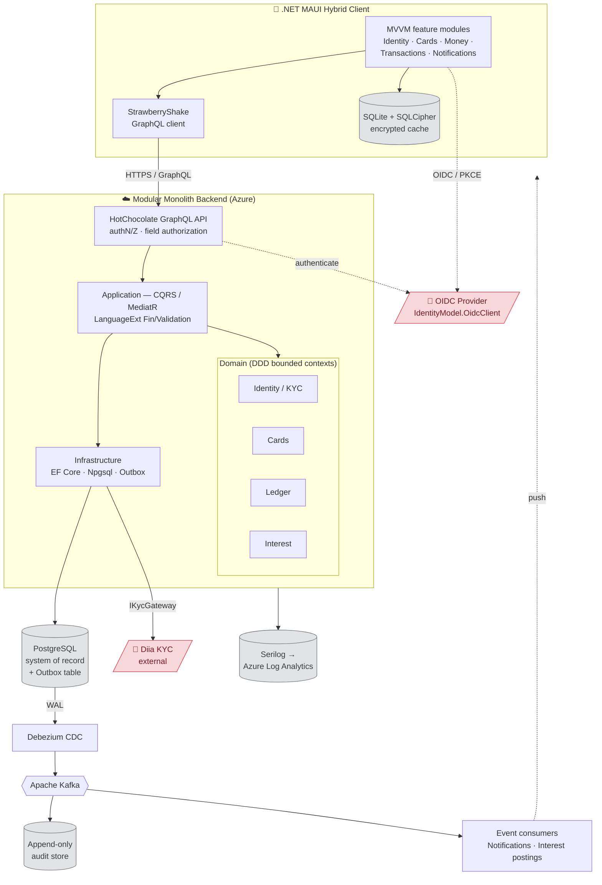

# 🏦 Homework 3: Virtual Credit Card

> **Student Name**: Vitalii Kulykivskyi
> **Date Submitted**: 2026-06-02
> **AI Tools Used**: [Claude Code (Model: Opus 4.8), Spec Kit, VS Code]

Homework 3 is an exercise in **specification-driven development**. Instead of jumping straight to
code, the goal was to use **[Spec Kit](https://github.com/github/spec-kit)** together with Claude
Code to turn a single natural-language product idea into a complete, reviewable engineering
specification — constitution, feature spec, clarifications, technical plan, design artifacts, and a
dependency-ordered task list — for a FinTech **Virtual Credit Card Management** platform.

## Summary of What Was Done

Starting from one prompt — *"Build a FinTech application that manages a virtual credit card…"* — the
following artifacts were produced under `specs/001-virtual-credit-card/`:

| Artifact | Purpose |
|----------|---------|
| `.specify/memory/constitution.md` | 7 governing principles (security, GDPR, auditability, quality, testing, UX, performance) — ratified as **v1.0.0** |
| `spec.md` | 8 prioritized user stories, 39 functional requirements, 12 measurable success criteria, edge cases, key entities |
| `checklists/requirements.md` | Spec-quality checklist used to validate completeness |
| `plan.md` | Technical plan: stack, architecture, constitution gate check, project structure |
| `research.md` | Phase 0 — technology decisions and rationale |
| `data-model.md` | Phase 1 — entities, relationships, money/ledger model |
| `contracts/schema.graphql` | GraphQL API contract (queries, mutations, subscriptions) |
| `contracts/events.md` | Kafka event/message contracts (audit, notifications, interest) |
| `contracts/kyc-integration.md` | Diia KYC integration contract |
| `quickstart.md` | Developer onboarding / local run guide |
| `tasks.md` | Phase 2 — dependency-ordered, story-grouped implementation tasks |

The product covers: Diia (Ukraine government ID) **KYC-gated registration**, virtual card lifecycle
(create / freeze / unfreeze), **company-suggested and personal credit limits**, payments,
deposits, withdrawals (with a 3% cash-advance fee on the credit-funded portion), filtered
transaction history, notifications, **daily deposit interest** on the minimum daily balance, and a
**60-day interest-free credit period** with post-grace daily credit interest.

## How the Specification Was Generated

The spec was built incrementally through the Spec Kit workflow, each step driven by a Claude Code
slash command and reviewed before moving on:



1. **`/constitution`** — established 7 non-negotiable/quality principles that act as a gate for all
   later design decisions.
2. **`/specify`** — converted the product idea into a structured, testable spec (user stories with
   priorities, functional requirements, success criteria) free of implementation detail.
3. **`/clarify`** — surfaced and resolved ambiguities through targeted questions; answers (e.g. *KYC
   blocks all financial functionality until it passes*) were encoded back into `spec.md`.
4. **`/plan`** — chose the technical approach and generated the design artifacts (`research.md`,
   `data-model.md`, `contracts/`), re-checking every constitution gate after design.
5. **`/tasks`** — derived a dependency-ordered, per-user-story task breakdown ready for
   implementation.

The constitution check is the key control: the plan documents how each of the 7 principles is
satisfied (e.g. immutable audit via transactional outbox + Debezium CDC, idempotency keys on every
money command, minimal KYC field storage) **before** any task is generated.

## Use-Case Diagram

The most common use cases, grouped by feature area, with the implied
`include` / `extend` relationships from the spec:



| Use case | Story / FRs |
|---|---|
| Register → verify via Diia (`include`) | US1 · FR-031–039 |
| Diia failure → manual review (`extend`) | US1 · FR-036 |
| Create card requires passed KYC | US2 · FR-001, FR-033 |
| Set personal limit (≤ company max) | US2 · FR-004–008 |
| Make payment (active card, within capacity) | US3 · FR-009–011 |
| Deposit / withdraw; credit-funded withdrawal → 3% fee | US4 · FR-012–016 |
| Freeze / unfreeze | US5 · FR-002–003 |
| View / filter transactions | US6 · FR-017–019 |
| Notifications (triggered by changes & failures) | US7 · FR-020–022 |
| Daily interest (system-driven) | US8 · FR-023–026 |

## Architecture

The plan specifies a **.NET 10 modular monolith** organized by DDD bounded contexts, a HotChocolate
**GraphQL** API, **PostgreSQL** as the system of record, and a fully decoupled audit/event pipeline
over **Kafka** (fed by a transactional **outbox** via **Debezium** CDC). The client is a **.NET MAUI
Hybrid** app. Everything is hosted on **Azure**.



**Key architectural decisions** (from `plan.md`):

- **Modular monolith over microservices** — cheaper to operate at ~10k-user scale while preserving
  DDD boundaries and a clean extraction path. Modules talk in-process via MediatR and
  asynchronously via Kafka.
- **Functional error handling** — LanguageExt `Fin<T>` / `Validation` instead of exceptions for
  control flow.
- **Decoupled auditability** — a transactional outbox + Debezium CDC streams every finance/security
  action into an append-only audit store, satisfying the immutable-audit principle.
- **Idempotency everywhere** — money commands carry idempotency keys so retries never double-process.
- **GDPR data minimization** — only the KYC result, a Diia reference, and minimal identifiers are
  stored (no document images).

## Repository Layout

```text
homework-3/
├── .specify/
│   ├── memory/constitution.md        # Project constitution (v1.0.0)
│   └── templates/                    # Spec Kit templates
├── specs/001-virtual-credit-card/
│   ├── spec.md                       # Feature specification
│   ├── plan.md                       # Technical implementation plan
│   ├── research.md                   # Phase 0 — tech decisions
│   ├── data-model.md                 # Phase 1 — entities & relationships
│   ├── quickstart.md                 # Developer onboarding
│   ├── tasks.md                      # Phase 2 — implementation tasks
│   ├── checklists/requirements.md    # Spec-quality checklist
│   └── contracts/                    # GraphQL schema, Kafka events, KYC integration
└── CLAUDE.md                         # Project context for Claude Code
```

## How to Reproduce the Spec Workflow

Within Claude Code (with Spec Kit installed), the spec was produced by running these commands in
order:

```text
/speckit-constitution   # ratify governing principles
/speckit-specify        # generate spec.md from the product idea
/speckit-clarify        # resolve ambiguities, encode answers back into the spec
/speckit-plan           # produce plan.md + research/data-model/contracts
/speckit-tasks          # generate dependency-ordered tasks.md
```

The next phase, `/speckit-implement`, would execute `tasks.md` to build the modular monolith and
MAUI client described above.
