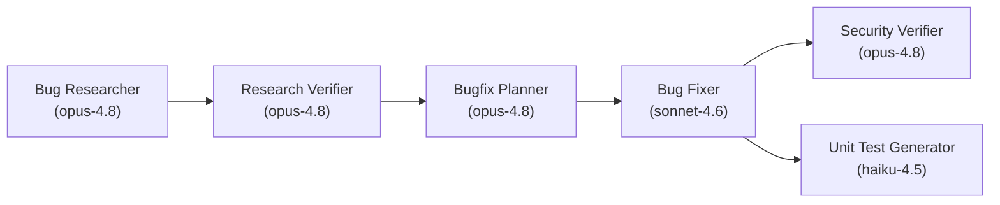

# 🤖 Homework 4: 6-Agent Bug-Fixing Pipeline

> **Student Name**: Vitalii Kulykivskyi
> **Date Submitted**: 2026-06-21
> **AI Tools Used**: Claude Code (Models: Opus 4.8, Sonnet 4.6, Haiku 4.5)

A single-command pipeline of Claude Code agents that take a bug from diagnosis through fix,
security review, and test generation — operating on a sample **.NET customer-support ticket API**
that contains intentionally seeded defects.

## Pipeline



**Run order**: Bug Researcher → Research Verifier → Bugfix Planner → Bug Fixer → Security Verifier →
Unit Test Generator. Each stage hands off to the next through an artifact in the bug context folder,
so the chain is fully connected from a single `bug-context.md` seed.

## One command

```bash
npm run pipeline                 # runs the full chain on bug 001
npm run pipeline -- 001 --dry-run   # preview stage order without invoking models
```

The orchestrator (`scripts/run-pipeline.mjs`) runs each stage in order, **auto-loads each stage's
skill**, passes the per-stage prompt to `claude` via stdin (robust against shell quoting), runs with
`--permission-mode bypassPermissions` so the fix/test stages can run `dotnet test`, and **halts if a
required input artifact is missing**. (Node is used only as the orchestrator; the application is
.NET.)

## Agents & model selection (and why)

Each agent declares its model in its `agents/*.agent.md` frontmatter.

| Stage | Agent | Model | Why |
|-------|-------|-------|-----|
| 1 | `bug-researcher` | `claude-opus-4-8` | Root-cause analysis across a layered codebase — highest-reasoning step; a wrong diagnosis misleads everything downstream. |
| 2 | `research-verifier` | `claude-opus-4-8` | Fact-checks every file:line claim; a wrongly "verified" reference poisons the chain. |
| 3 | `bugfix-planner` | `claude-opus-4-8` | Decides the correct minimal fix as exact before/after edits the fixer applies literally. |
| 4 | `bug-fixer` | `claude-sonnet-4-6` | Applies an already-decided plan and runs tests — strong coding at balanced cost; the hard reasoning was done upstream. |
| 5 | `security-verifier` | `claude-opus-4-8` | Vulnerability review tolerates few false negatives; strongest reasoning for security. |
| 6 | `unit-test-generator` | `claude-haiku-4-5` | Scaffolds xUnit tests for already-changed code against a clear FIRST rubric — routine, well-bounded work. |

## Skills

- `skills/research-quality-measurement.md` — named quality levels (EXCELLENT / ADEQUATE / POOR /
  UNRELIABLE) used by the Research Verifier.
- `skills/unit-tests-FIRST.md` — Fast, Independent, Repeatable, Self-validating, Timely; used by the
  Unit Test Generator.

## Application under test (`src/`)

A .NET 10 customer-support ticket API in Clean Architecture (`Domain`, `Application`,
`Infrastructure`, `API`) with an xUnit test project in `tests/Tests/`. Test command: `dotnet test`.

### Seeded defect for bug 001
`context/bugs/001/bug-context.md`: *"Ticket is stored to the database twice when created."* The
root cause is a duplicated persistence call in `src/Application/Tickets/TicketHandlers.cs`
(`CreateTicketCommandHandler.Handle` calls `repository.Add(...)` twice). The pipeline discovers,
plans, fixes, security-reviews, and tests this.

## Pipeline artifacts (generated into `context/bugs/001/`)

- `research/codebase-research.md` — Bug Researcher
- `research/verified-research.md` — Research Verifier
- `implementation-plan.md` — Bugfix Planner
- `fix-summary.md` — Bug Fixer
- `security-report.md` — Security Verifier
- `test-report.md` — Unit Test Generator

Contracts for each artifact live in `specs/001-agent-pipeline/contracts/`.

## Project structure

```
homework-4/
├── README.md / HOWTORUN.md
├── agents/                # 6 agent definitions (model in frontmatter)
├── skills/                # research-quality-measurement, unit-tests-FIRST
├── context/bugs/001/      # bug-context.md (seed) + generated artifacts
├── scripts/               # run-pipeline.mjs (orchestrator) + pipeline-core.mjs + tests
├── src/                   # .NET app (Domain/Application/Infrastructure/API)
├── tests/Tests/           # xUnit test project (dotnet test)
├── docs/screenshots/      # pipeline run, fix, security scan, unit tests
└── specs/001-agent-pipeline/   # spec-kit spec, plan, contracts
```

## Verify

```bash
dotnet test tests/Tests/Tests.csproj   # application test suite
npm run test:pipeline                  # orchestrator wiring tests (node --test)
```

See **HOWTORUN.md** for full instructions.
