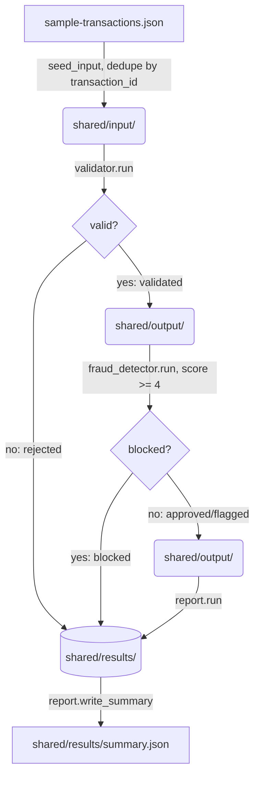

# Architecture

This document describes how the FinTech transaction pipeline is put together: the
file-based staging protocol, the three processing stages, the orchestrator that
drives them, and the layers built on top (dashboard API, MCP server, pre-commit
gate).

See also: [`README.md`](../README.md) · [`docs/data-model.md`](data-model.md) ·
[`docs/api.md`](api.md) · [`docs/compliance.md`](compliance.md) ·
[`specification.md`](../specification.md) · [`research-notes.md`](../research-notes.md).

## Layering (Clean Architecture, Constitution IV)

```
pipeline/*.py        <- domain + application logic, framework-free
orchestrator.py       <- application entry point, drives the stages, no FastAPI import
frontend/app.py       <- infrastructure/delivery layer (FastAPI), imports orchestrator
mcp/server.py         <- infrastructure/delivery layer (FastMCP), reads shared/results/ only
```

- `pipeline/common.py`, `pipeline/validator.py`, `pipeline/fraud_detector.py`, and
  `pipeline/report.py` have no dependency on FastAPI, uvicorn, or any web framework.
  Each stage exposes a pure `run(input_dir, processing_dir, ..., audit_log_path)`
  function operating only on `pathlib.Path` arguments, so it is testable in
  isolation and callable from any driver.
- `orchestrator.py` depends only on `pipeline.*`. It has no FastAPI/uvicorn import,
  so it can be called directly by `frontend/app.py`'s `POST /run` handler or by the
  test suite without pulling in the web framework.
- `frontend/app.py` is the only module that depends on FastAPI; it imports
  `orchestrator` and re-exposes `run_pipeline()` over HTTP. Dependencies point
  inward: the web layer depends on the pipeline, never the reverse.
- `mcp/server.py` is a separate, read-only delivery layer over `shared/results/`.
  It is pre-existing, unmodified by this pipeline's specification, and never
  mutates pipeline state.

## The file-based pipeline protocol

All inter-stage communication happens through a runtime directory tree, `shared/`
(excluded from version control — see `.gitignore` — because it is entirely
regenerated on every run):

```
shared/
├── input/       one JSON envelope file per transaction, written by the orchestrator
├── processing/  a stage moves a record here transiently while it works on it
├── output/      a stage writes its result here for the next stage to pick up
├── results/     terminal outcomes, one JSON file per transaction, plus summary.json
└── audit/       append-only audit.log (JSONL, one entry per line) — never reset
```

`reset_shared_directories()` (`orchestrator.py`) deletes and recreates `input/`,
`processing/`, `output/`, and `results/` on every run, so `results/` always reflects
only the latest batch. `shared/audit/` is only created if missing — it is **never**
truncated by the orchestrator, satisfying Constitution III ("audit logs must be
retained ... and protected from ... deletion by application-level actors").

Every JSON file exchanged between stages is a **standard envelope** — see
[`docs/data-model.md`](data-model.md#the-standard-envelope) for the exact schema.

## Stage sequence



`orchestrator.run_pipeline()` (`orchestrator.py:136`) drives the three stages
**synchronously and in order**, each call passing the shared directories:

1. `validator.run(input_dir, processing_dir, output_dir, results_dir, audit_log_path)`
   drains `shared/input/`. Every envelope is moved to `processing/` while being
   validated, then routed onward:
   - **Invalid** → terminal write to `shared/results/<transaction_id>.json` with
     `data.status = "rejected"` and `data.reasons = [...]`. The record never
     reaches the fraud stage (short-circuit).
   - **Valid** → `data.status = "validated"`, written to `shared/output/`.
2. `fraud_detector.run(output_dir, processing_dir, output_dir, results_dir, audit_log_path)`
   drains the **same** `shared/output/` directory the validator just populated
   (the file-based protocol defines a single hand-off directory, reused by
   design — see `research-notes.md`, "Directory hand-off for `shared/output/`").
   Every record is scored (`score_transaction`) and decided (`decide`):
   - **`blocked`** (score ≥ 4) → terminal write to `shared/results/`.
   - **`approved` / `flagged`** → written back into `shared/output/` carrying
     `score` and `reasons`, for the report stage to pick up.
3. `report.run(output_dir, processing_dir, results_dir, audit_log_path)` drains
   `shared/output/` (now holding only `approved`/`flagged` records — `blocked`
   and `rejected` records already bypassed it) and finalizes each into
   `shared/results/<transaction_id>.json` via `finalize_record()`.

Every write into `shared/results/` — whether from the validator's rejection path,
the fraud detector's block path, the report stage's finalize path, or the
orchestrator's duplicate-id rejection — goes through
`pipeline.common.write_result_if_absent()`, a first-write-wins guard. This makes
"every transaction reaches exactly one terminal result" hold even if a
`transaction_id` collides with one already finalized.

After the three `run()` calls return, `run_pipeline()` polls
`shared/results/` (0.05s interval, 30s bounded timeout — never an infinite wait,
Constitution VII) until every transaction id returned by `seed_input()` has a
terminal file, then calls `report.write_summary(results_dir)` and returns/prints
the aggregate summary.

## Short-circuit / terminal-status flow

Every transaction reaches **exactly one** of four terminal statuses, and once a
record is terminal it is never touched by a later stage:

| Status | Set by | Reaches `shared/output/`? |
|---|---|---|
| `rejected` | orchestrator (duplicate id) or validator (rule violation) | No |
| `blocked` | fraud_detector (score ≥ 4) | No |
| `flagged` | fraud_detector (score 2–3), finalized by report | Yes, then finalized |
| `approved` | fraud_detector (score 0–1), finalized by report | Yes, then finalized |

## Orchestrator seeding and de-duplication

`seed_input()` (`orchestrator.py:50`) reads `sample-transactions.json`, and for
each record:

- If its `transaction_id` was already seen earlier in the same batch, the record
  is written straight to `shared/results/` as `status="rejected"`,
  `reasons=["duplicate transaction_id in input batch"]`, and is **not** sent
  through validation.
- Otherwise it is wrapped in the standard envelope with a fresh `uuid4`
  `message_id`, `data.origin_country` set from `data.metadata.country`, and
  `data.status = "pending"`, then written to `shared/input/<transaction_id>.json`.

## Frontend (delivery layer)

`frontend/app.py` is a FastAPI app exposing two authenticated JSON endpoints
(`POST /run`, `GET /results` — see [`docs/api.md`](api.md)) and mounting
`frontend/static/` (plain HTML/CSS/JS, no build step, no JS framework) at `/`.
`POST /run` calls `orchestrator.run_pipeline(shared_root=_SHARED_ROOT)` directly —
there is no separate process boundary between the dashboard and the pipeline; the
web layer is a thin, authenticated wrapper.

## MCP server (read-only query layer)

`mcp/server.py` is a `FastMCP` server, pre-existing and unmodified by this
pipeline's implementation. It reads `shared/results/` only (never `input/`,
`processing/`, or `output/`) and never mutates pipeline state. See
[`mcp/README.md`](../mcp/README.md) and [`docs/api.md`](api.md#mcp-server-surface-mcpserverpy)
for its tool/resource surface.

## Pre-commit gate

`.githooks/pre-commit` runs `pytest --cov=pipeline --cov=orchestrator --cov=frontend
--cov-fail-under=80` and blocks the commit if line coverage drops below 80%, or if
any test fails. It is self-scoped (only runs on commits touching `homework-6/`) and
skips entirely if `homework-6/tests/` does not exist yet. See
[`.githooks/README.md`](../.githooks/README.md) for install/bypass details.
